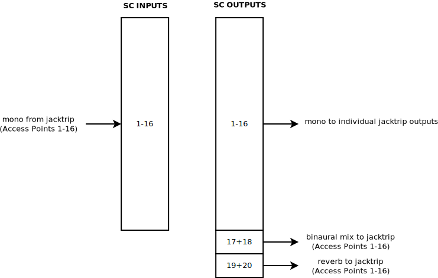

SPRAWL
======

SPRAWL is a network system for enhanced interaction in
musical performances. The client-server approach can be used
in local and global networks.

Startup
-------

The startup of the SPRAWL system is managed through bash scripts:

1. **Server:**
	After the Jack server was started manually, *start_SERVER.sh* starts the SPRAWL SuperCollider server software and JackTrip.
2. **Access Point:**
	*start_maintenance.sh* starts *start_update.sh* and carries out necessary maintenance work.
3. **Access Point:**
	*start_update.sh* pulls the latest changes of the sprawl git repository.
4. **Access Point:**
	*start_jack_client.sh* asks the user for the buffer size of the server over a graphical user interface.
	Afterwards it starts the Jack server with the right buffer size and JackTrip with the server that is hardcoded in the script.
5. **Server:**
	*start_SERVER_post_client_connect.sh* starts the spatializer and any other wanted programs after all access points connected to the server. It establishes all required Jack connections with JMess.


All startup scripts of the access points are invoked when the devices are powered on.

On the server JackTrip starts in hub server mode (-S) with the SPRAWL jack connection preset (-p 3):
```
jacktrip -S -p 3
```

All clients (access points) connect to the server with the number of channels to be used:
```
jacktrip -n <nr of channels> -C <server-ip>
```
Mind the capital letters for both server and client parameters.


The Basic Server
----------------



