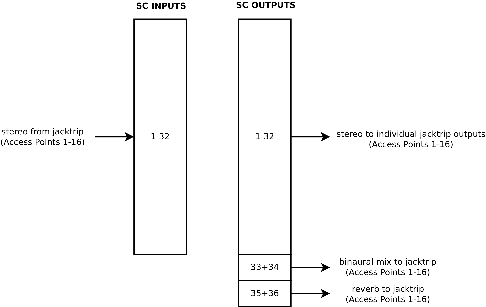

# SPRAWL


SPRAWL is a network system for enhanced interaction in
musical performances. The client-server approach for distributing
audio and control data can be used in local and global networks.


## The Basic Server


The basic SC server offers binaural rendering with OSC control.
In the recent version, all access points send and receive two
channels of audio to the server. Signals from the access
points can be raouted to specific targets via OSC command.
All access points receive the full binaural mix and selected
sources. The server is per default configured for up to 16 access points,
each with two channels:

Acess Point | Sources

---     | ---
0       | 0,1
1       | 2,3
2       | 4,5
...     | ...
15      | 30,31

Inputs and outputs of the SC Jack client are assigned as follows:



### OSC Messages

Sending OSC messages can be tested with the PD patches
`control_position.pd` and `control_sends.pd`.
The default server listens to the following messages:


#### Routing

For each access point, the server adds two virtual sound sources.
Individual channels from each access point can be routed to any virtual sound source:

    /route/spatial i i i f

- first argument: send access point index (0...15)
- second argument: send channel to use (0,1)
- third argument: virtual sound source index (0...31)
- fourth argument: gain (0...1)

The default routing can be restored at any time with the OSC message:

    /default_spatial_routing

All spatial routing gains can be set to 0 with the following OSC message:

    /mute_all_spatial


Individual channels from each access point can be routed
to individual channels of other access points:

    /route/pi i i i f

- first argument: send access point index (0...15)
- second argument: send channel to use (0,1)
- third argument: receive access point index (0...15)
- fourth argument: receive channel to use (0,1)
- fifth argument: gain (0...1)

All AP routing gains can be set to 0 with the following OSC message:

    /mute_all_ap


#### Spatial

Source positions are controlled in spherical coordinates.

    /source/azim i f

- first argument: virtual sound source index (0...32)
- second argument: azimuth angle (-pi ... pi)

    /source/elev i f

- first argument: virtual sound source index (0...32)
- second argument: elevation angle (-pi ... pi)

    /source/dist i f

- first argument: virtual sound source index (0...32)
- second argument: distance in meters (0 ... 10)

Sources can be routed to a convolution reverb, which is
independent from the spatial source position:

    /source/reverb i f

- first argument: virtual sound source index (0...32)
- second argument: reverb gain (0 ... 1)

#### Monitoring

For each access point, the gain of the binaural mix can be set:

    /monitor/gain f

- argument: the monitor gain (0...1)

The binaural mix can also be summed to a single channel.
In that case, only the first (left) channel of the acces
point is used for monitoring:

    /monitor/mono f

- argument: (0....1) 0=stereo, 1=mono

## Dependencies

- jacktrip
- SuperCollider
    - SC-HOA
- Puredata

## Install

### Client

more

### Server

more

## Startup


The startup of the SPRAWL system is managed through bash scripts:

1. **Server:**
	After the Jack server was started manually, *start_SERVER.sh* starts the SPRAWL SuperCollider server software and JackTrip.
2. **Access Point:**
	*start_maintenance.sh* starts *start_update.sh* and carries out necessary maintenance work.
3. **Access Point:**
	*start_update.sh* pulls the latest changes of the sprawl git repository.
4. **Access Point:**
	*start_jack_client.sh* asks the user for the buffer size of the server over a graphical user interface.
	Afterwards it starts the Jack server with the right buffer size and JackTrip with the server that is hardcoded in the script.
5. **Server:**
	*start_SERVER_post_client_connect.sh* starts the spatializer and any other wanted programs after all access points connected to the server. It establishes all required Jack connections with JMess.


All startup scripts of the access points are invoked when the devices are powered on.

On the server JackTrip starts in hub server mode (-S) with the SPRAWL jack connection preset (-p 3):
```
jacktrip -S -p 3
```

All clients (access points) connect to the server with the number of channels to be used:
```
jacktrip -n <nr of channels> -C <server-ip>
```
Mind the capital letters for both server and client parameters.


